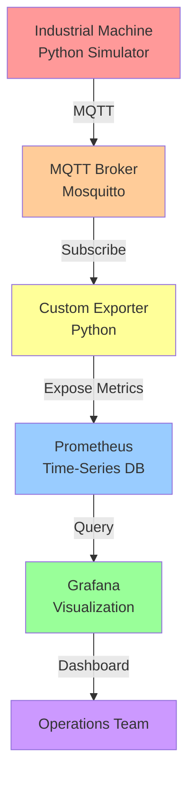

# Virtual Factory — Industrial Observability with DevOps

A **simulation project of industrial environments (OT)** featuring a complete pipeline for **telemetry, monitoring, and observability**, leveraging DevOps practices widely adopted in the industry.

The project simulates a real shop-floor scenario using only a laptop, integrating OT (Operational Technology) + IT (Information Technology) concepts.

---

## 🎯 Objective

Simulate an industrial machine publishing operational data and build a complete observability pipeline, from telemetry generation through executive dashboard visualization.

This demonstrates the **closed-loop monitoring paradigm** essential for modern manufacturing: **Sense → Collect → Analyze → Respond**.

---

## 🏗️ General Architecture



### Architecture Layers

| Layer | Component | Purpose |
|-------|-----------|---------|
| **Data Generation** | Industrial Machine (Python) | Simulates real sensors and operational state |
| **Message Bus** | MQTT Broker (Mosquitto) | Decouples producer from consumer; enables pub/sub pattern |
| **Translation** | Custom Exporter | Converts business events → standard metrics format |
| **Storage** | Prometheus | Time-series database optimized for metrics |
| **Visualization** | Grafana | Real-time dashboards for decision-making |

---

## 🛠️ Technologies Used

| Technology | Role | Rationale |
|-----------|------|-----------|
| **Docker & Docker Compose** | Infrastructure-as-Code | Ensures reproducibility and portability |
| **Python 3.10+** | Simulation & Export | Rapid prototyping; rich ecosystem for industrial use |
| **MQTT (Mosquitto)** | Message Broker | Lightweight, IoT-standard protocol for OT environments |
| **Prometheus** | Metrics Collection | Industry-standard TSDB for time-series data |
| **Grafana** | Dashboard & Analytics | Enterprise-grade visualization; alerting capabilities |
| **Paho MQTT Client** | MQTT Library | Robust, production-tested client library |
| **Prometheus Client** | Metrics Export | Official library for exporting Prometheus metrics |

---

## 🏭 Industrial Machine Simulation

The industrial machine is simulated via Python and generates, at regular intervals:

* **Temperature** — Equipment core/bearing temperature (°C)
* **Vibration Level** — Bearing/spindle vibration amplitude (m/s²)
* **Operational Status** — Running/Idle/Error states

Data is published via MQTT in JSON format, mimicking real IoT sensor behavior.

### Key Simulation Features

- ⏱️ **Realistic Time Series:** Temperature and vibration drift over time
- 🔄 **State Transitions:** Status changes between operational states
- 📊 **Stochastic Noise:** Natural sensor variation
- 🚨 **Anomaly Injection:** Optional fault injection for testing alerting

### Sample MQTT Message

```json
{
  "timestamp": "2025-04-27T14:32:45Z",
  "machine_id": "LATHE-001",
  "temperature_celsius": 72.5,
  "vibration_level": 2.8,
  "status": "running",
  "uptime_seconds": 3600
}
```

---

## 📊 Observability & Monitoring Strategy

### The Three Pillars of Observability

1. **Metrics** — Quantitative measurements over time (what we use here)
2. **Logs** — Discrete events and diagnostic information
3. **Traces** — Request/transaction flow across systems

This project focuses on **metrics-driven observability**, the primary signal for operational health in industrial environments.

### Custom Exporter

The **exporter component** acts as a bridge:
- Subscribes to MQTT topics
- Parses JSON payloads
- Converts business metrics → Prometheus format
- Exposes `/metrics` HTTP endpoint (port 8000)

This decoupling allows the machine simulation to remain independent of Prometheus concerns.

### Metrics Exposed

```
# HELP machine_temperature_celsius Equipment temperature in Celsius
# TYPE machine_temperature_celsius gauge
machine_temperature_celsius{machine_id="LATHE-001"} 72.5

# HELP machine_vibration_level Vibration amplitude in m/s²
# TYPE machine_vibration_level gauge
machine_vibration_level{machine_id="LATHE-001"} 2.8

# HELP machine_status Operational status (1=running, 0=idle, -1=error)
# TYPE machine_status gauge
machine_status{machine_id="LATHE-001"} 1
```

### Prometheus Scrape Configuration

```yaml
global:
  scrape_interval: 15s
  evaluation_interval: 15s

scrape_configs:
  - job_name: 'industrial_machine'
    static_configs:
      - targets: ['localhost:8000']
```

---

## ▶️ How to Run the Project

### Prerequisites

* **Docker Desktop** (Windows, macOS) or **Docker + Docker Compose** (Linux)
* **Python 3.10+** (for local development/simulation)
* **4GB RAM minimum** recommended for all services

### Step-by-Step

#### **1. Start the Infrastructure Stack**

```bash
docker compose up -d
```

This brings up:
- MQTT Broker (port 1883)
- Prometheus (port 9090)
- Grafana (port 3000)

#### **2. Start the Industrial Machine Simulator**

Open a new terminal:

```bash
cd machine
python machine.py
```

**Expected output:**
```
[INFO] Starting machine simulator...
[INFO] Connecting to MQTT broker at localhost:1883
[INFO] Publishing metrics every 5 seconds
```

#### **3. Start the Custom Exporter**

Open another terminal:

```bash
cd exporter
python exporter.py
```

**Expected output:**
```
[INFO] Exporter listening on http://localhost:8000
[INFO] Subscribed to MQTT topics
[INFO] Exposing Prometheus metrics
```

#### **4. Verify All Services Are Healthy**

```bash
# Check MQTT broker
curl -X GET http://localhost:1883 2>/dev/null || echo "MQTT running"

# Check Prometheus
curl -s http://localhost:9090/-/healthy | grep -q "ok" && echo "Prometheus OK"

# Check metrics export
curl -s http://localhost:8000/metrics | head -10
```

#### **5. Access the Services**

| Service | URL | Credentials |
|---------|-----|-------------|
| **Grafana** | http://localhost:3000 | admin / admin |
| **Prometheus** | http://localhost:9090 | — |
| **Raw Metrics** | http://localhost:8000/metrics | — |

---

## 📈 Dashboard & Visualization

### Setting Up Grafana

1. **Log in** to Grafana (http://localhost:3000)
2. **Add Data Source:**
   - Type: Prometheus
   - URL: http://prometheus:9090
   - Click "Save & Test"

3. **Import Dashboard** (or create custom):
   - Navigate to Dashboards → Import
   - Paste example dashboard JSON (provided in `grafana/dashboards/`)
   - Select the Prometheus data source

### Key Dashboard Panels

| Panel | Metric | Use Case |
|-------|--------|----------|
| **Temperature Trend** | `machine_temperature_celsius` | Thermal monitoring; predictive maintenance |
| **Vibration Analysis** | `machine_vibration_level` | Bearing health; imbalance detection |
| **Uptime Gauge** | `up{job="industrial_machine"}` | Machine availability; SLA compliance |
| **Alert Status** | Alert rules | Real-time notifications |

### Example Query (PromQL)

```promql
# 5-minute moving average of temperature
avg_over_time(machine_temperature_celsius[5m])

# Alert if vibration exceeds threshold for 2 minutes
machine_vibration_level > 5
```

---

## 🔧 Architecture Patterns Demonstrated

### 1. **Event-Driven Architecture**
MQTT decouples the machine simulator from the exporter — either component can be replaced or scaled independently.

### 2. **Time-Series Data Model**
Prometheus stores data as (timestamp, value, labels), enabling efficient queries for trends and anomalies.

### 3. **12-Factor App Principles**
- Configuration via environment variables
- Stateless services (state in external DB/broker)
- Logs as event streams (MQTT messages)

### 4. **Monitoring as Code**
Prometheus scrape configs, alerting rules, and Grafana dashboards are declarative (YAML/JSON).

---

## 📋 Production Readiness Checklist

This project is **educational**. For production industrial deployments, add:

- ✅ **Alertmanager** integration for multi-channel notifications (email, Slack, PagerDuty)
- ✅ **TLS/SSL** encryption for MQTT and Prometheus communication
- ✅ **Authentication** (MQTT username/password, Prometheus API tokens)
- ✅ **Data Retention** policy (Prometheus retention, log archival)
- ✅ **High Availability** (multi-node Prometheus, redundant brokers)
- ✅ **Backup & Recovery** procedures
- ✅ **Audit Logging** (who accessed which metrics)
- ✅ **SLA monitoring** (uptime targets, MTTR tracking)

---

## 🚀 Future Enhancements

- [ ] **Alertmanager Integration** — Multi-channel alerts (email, SMS, Slack)
- [ ] **Operational Failure Injection** — Simulate bearing failure, overheating, power loss
- [ ] **Exporter Containerization** — Docker image for seamless deployment
- [ ] **High Availability** — Multi-instance setup with load balancing
- [ ] **Machine Learning** — Anomaly detection using Prometheus metrics
- [ ] **Trace Integration** — OpenTelemetry instrumentation for distributed tracing
- [ ] **Grafana Alerting Rules** — Threshold-based notifications
- [ ] **Cost Optimization** — Metrics aggregation, downsampling strategies

---

## 📂 Project Structure

```
virtual-factory/
├── docker-compose.yml          # Infrastructure orchestration
├── machine/
│   ├── machine.py              # Industrial machine simulator
│   └── requirements.txt         # Python dependencies
├── exporter/
│   ├── exporter.py             # MQTT → Prometheus bridge
│   └── requirements.txt         # Python dependencies
├── prometheus/
│   └── prometheus.yml          # Prometheus scrape configuration
├── grafana/
│   ├── dashboards/             # Pre-built dashboard definitions
│   └── datasources/            # Data source configurations
└── README.md                   # This file
```

---

## 🎓 Learning Outcomes

By studying and extending this project, you will understand:

1. **OT/IT Integration** — How operational systems communicate with IT infrastructure
2. **Time-Series Databases** — Design and query patterns for metrics
3. **IoT Data Collection** — MQTT pub/sub, message formats, reliability
4. **Observability Architecture** — Multi-layer monitoring and visualization
5. **DevOps Practices** — Infrastructure-as-Code, containerization, monitoring
6. **Industrial Monitoring** — Predictive maintenance, anomaly detection, SLAs

---

## 📜 License & Attribution

**Project created exclusively for educational purposes.**

* **Usage:** Permitted for individuals and institutions for learning and authorized industrial testing
* **Restriction:** Commercial use without attribution is not permitted
* **Responsibility:** Use responsibly; obtain proper authorization before monitoring production systems

---

## ✨ Acknowledgments

This project demonstrates real-world patterns used in:
- **Predictive Maintenance (PdM)** systems
- **Manufacturing Execution Systems (MES)**
- **Industrial IoT (IIoT)** platforms
- **Smart Factory (Industry 4.0)** initiatives

---

## 📧 Author

**Alan Jones Stacholski Júnior**

*Software Engineer | DevOps Practitioner | Industrial Automation Enthusiast*

---

## 🙏

> "Do you see someone skilled in their work? They will serve before kings." 
> — *Proverbs 22:29*

---

**Last Updated:** April 2025  
**Status:** Educational | Lab Environment | Active Development
