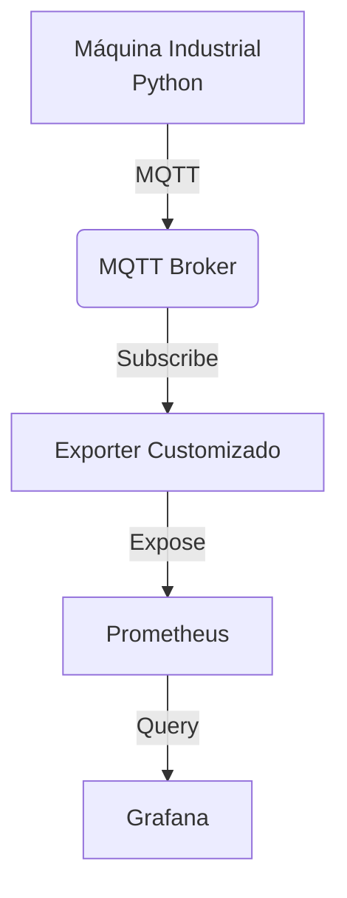

# 🏭 Fábrica Virtual — Observabilidade Industrial com DevOps

Projeto de **simulação de ambiente industrial (OT)** com pipeline completo de **telemetria, monitoramento e observabilidade**, utilizando práticas DevOps amplamente adotadas no mercado.

O projeto simula um cenário real de chão de fábrica utilizando apenas um notebook, integrando conceitos de OT + IT.

---

##  Objetivo

Simular uma máquina industrial publicando dados operacionais e construir um pipeline completo de observabilidade, desde a geração da telemetria até a visualização em dashboards executivos.

---

##  Arquitetura Geral



---

##  Tecnologias Utilizadas

* **Infraestrutura:** Docker & Docker Compose
* **Linguagem:** Python 3.10+
* **Broker:** MQTT (Eclipse Mosquitto)
* **Métricas:** Prometheus
* **Visualização:** Grafana
* **Libs:** Paho MQTT Client & Prometheus Client

---

##  Simulação da Máquina Industrial

A máquina industrial é simulada via Python e gera, em intervalos regulares:

*  Temperatura do equipamento
*  Nível de vibração
*  Status operacional

Os dados são publicados via MQTT no formato JSON.

---

##  Observabilidade e Monitoramento

* **Exporter customizado:** Converte eventos MQTT em métricas no padrão Prometheus.
* **Prometheus:** Realiza coleta periódica via *scrape*.
* **Grafana:** Consulta o Prometheus e exibe dashboards em tempo real.

### Métricas expostas

* `machine_temperature_celsius`
* `machine_vibration_level`

---

## ▶️ Como Executar o Projeto

### Pré-requisitos

* Docker Desktop
* Python 3.10 ou superior

### Passo a passo

**1. Subir os containers:**

```bash
docker compose up -d

```

**2. Iniciar a máquina simulada:**

```bash
cd machine
python machine.py

```

**3. Iniciar o exporter:**

```bash
cd exporter
python exporter.py

```

**4. Acessar os serviços:**

* **Grafana:** [http://localhost:3000](https://www.google.com/search?q=http://localhost:3000)
* **Prometheus:** [http://localhost:9090](https://www.google.com/search?q=http://localhost:9090)
* **Métricas (Raw):** [http://localhost:8000/metrics](https://www.google.com/search?q=http://localhost:8000/metrics)

---

## 📸 Dashboard

O dashboard apresenta métricas em tempo real voltadas para cenários de manutenção preditiva e monitoramento industrial:

* Temperatura da máquina
* Vibração

---

##  Próximas Evoluções

* [ ] Alertas com Alertmanager
* [ ] Simulação de falhas operacionais
* [ ] Containerização do exporter
* [ ] Alta disponibilidade

---

##  Licença

Projeto de uso educacional e demonstrativo.

## Jesus Te Ama!

```
